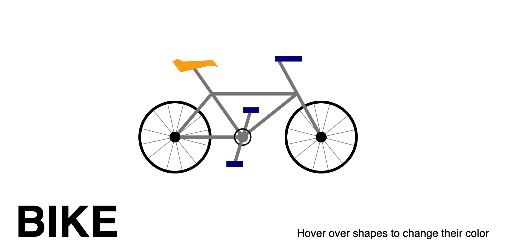
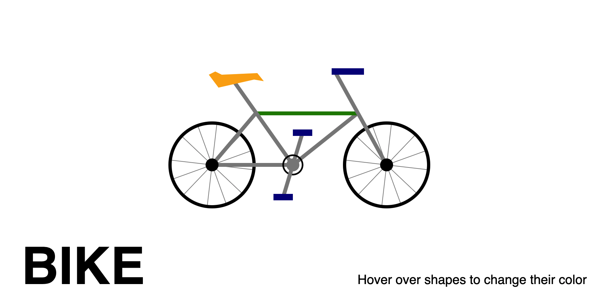
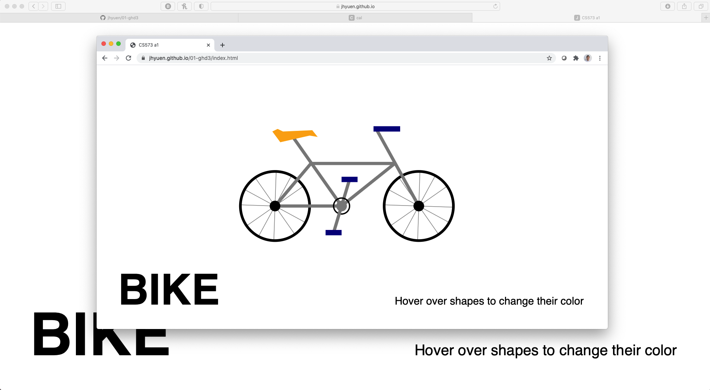
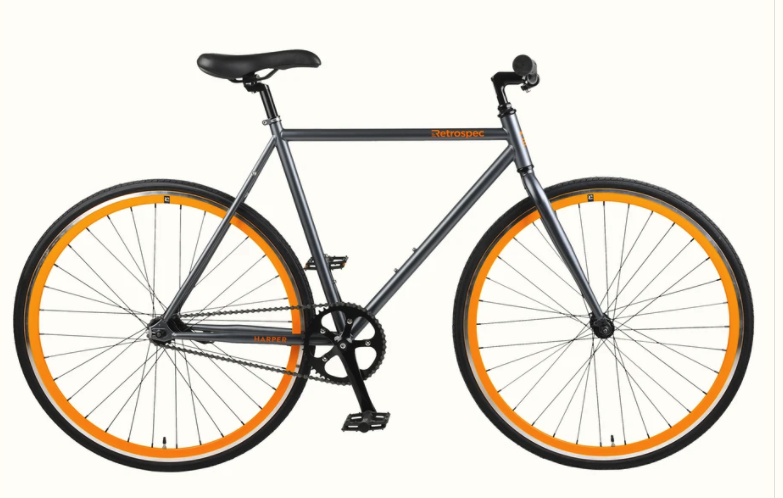
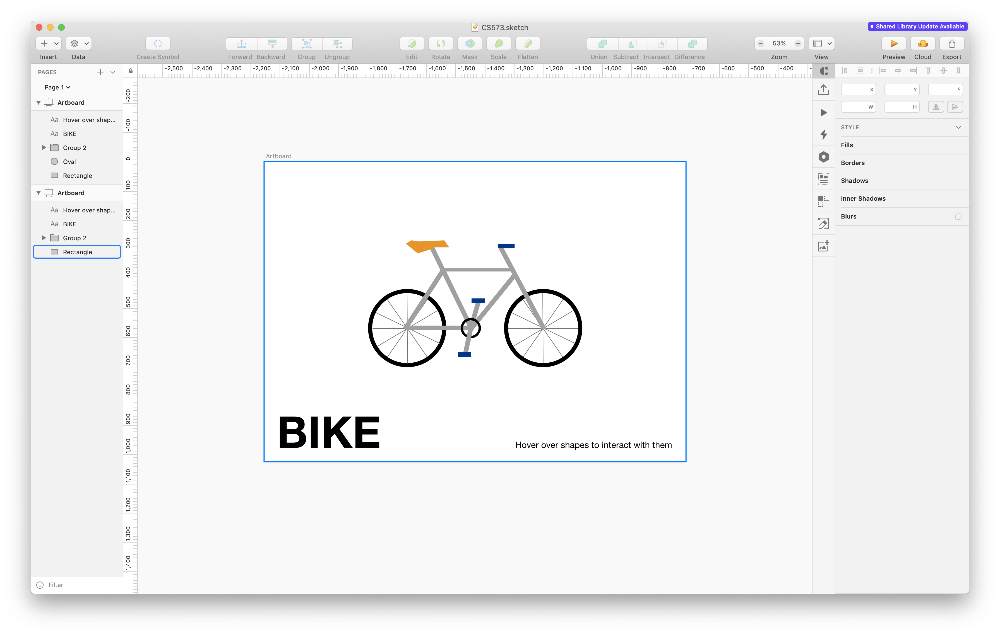

Assignment 1 - Hello World: GitHub and d3  
===

Author
---
Joseph Yuen

Project Link
---
https://jhyuen.github.io/01-ghd3/index.html

Description
---
This project demonstrates the use of d3 shapes, svgs, colors, and animation. 

Various lines, circles, rectangles, and polygons were assembled to form a picture of a bicycle as seen in the screenshot below. They were stored in an svg object which was contained in a re-sizeable viewBox that maintains the aspect ratio of the image. Additional colors and animation were added later for design and technical achievements.

Achievements
---
**Technical**
1. **Hover** - I implemented mouseover and mouseout events in combination with transitions to change the color of shapes upon hovering over them. In addition, id selectors to identify certain groups of shapes that required a different style to be changed. For example, some circles, required the stroke to be changed and the not the fill. In the picture below, I show what happens when the user hovers over a section of the bike. 

2. **Rotation Animation** - Upon entering the webpage, the wheels on the bike rotate clockwise. I accomplished this effect by using a d3.timer that loops based on real time. Initially, I tried using a transform in a transition, but I realized that I needed to calculate the previous angle of each wheel to keep the wheel rotating in place. Before, the wheel would rotate and move around instead of rotating and remaining in place.

3. **Re-sizeable Viewport** - I initially made the bike using the vw and vh units unaware that d3 uses the viewBox attribute to scale their graphs. Certain primitives like polygons didn't take vw and vh as inputs which forced me to redo my shapes using a viewBox attached to the svg object. By using viewBox, shapes and text are automatically resized forced to maintain a 1920x1080 aspect ratio as seen in the picture below.

**Design**
1. **Bike** - Based on the reference picture below, I created a simplified version of the bike using primitive shapes instead of just drawing a couple shapes on a canvas.

2. **Prototype** - Before I started to code, I created a vector version of a bike in Sketch based on picture above. I think that this is a design achievement as I planned out my design before I began to code.

3. **Text** - Even though it is not a large achievement, I framed the bike  using surrounding text that gives instructions to the user.

Resources
---
I started off with my own html boiler plate code that I have used in previous projects. Then, I used https://lucidar.me/en/d3.js/d3-js-summary/ as a reference guide to help me learn the basics of d3.