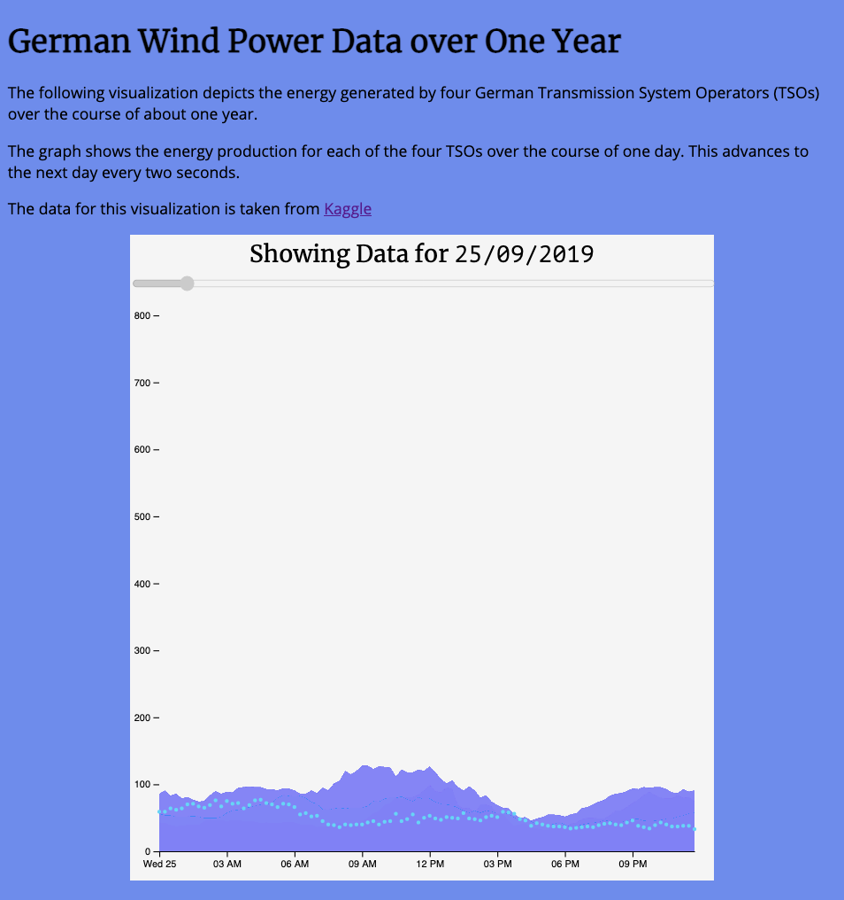
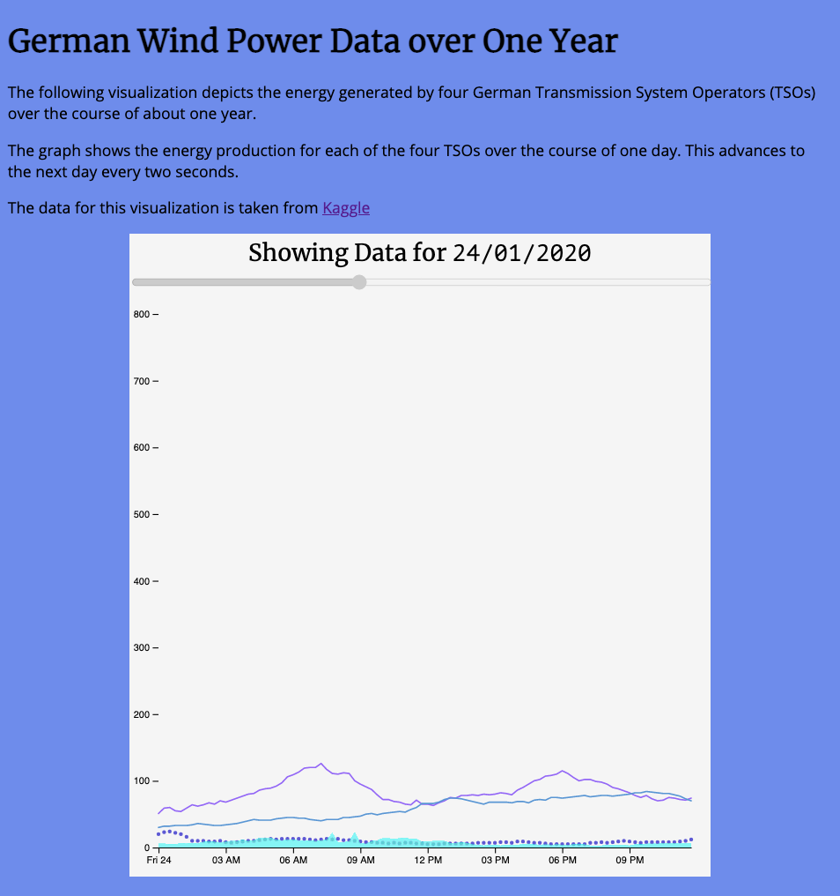
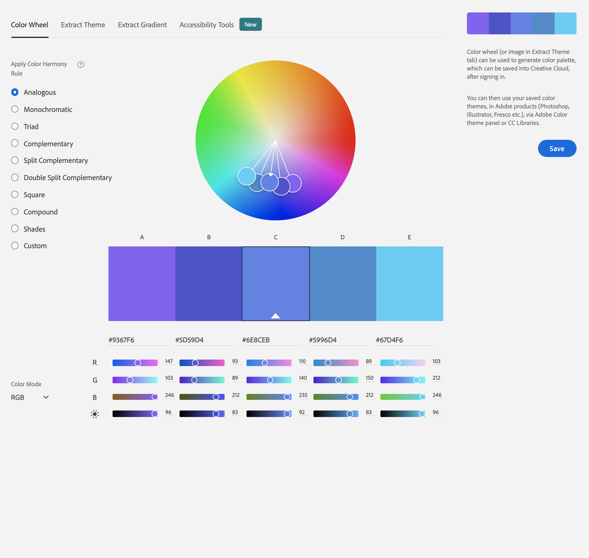

# Assignment 1 - Hello World: GitHub and d3 - Matthew St. Louis

The following link is my submission: [mastlouis.github.io/01-ghd3](https://mastlouis.github.io/01-ghd3)

## Description
I created a visualization to show wind power generation over time for four German Transmission System Operators (TSOs) using data from [Kaggle](https://www.kaggle.com/jorgesandoval/wind-power-generation?select=TransnetBW.csv).

The graph shows the wind energy production of each TSO over the course of one day, then advances to the next day every two seconds. Each time the graph is generated, each line of data will be constructed randomly from either line, circles, symbols, or fill. The colors should remain the same, though fill causes the colors to look different on my screen.

There is a slider at the top of the graph. It is disabled and is only meant to serve as a progress bar for how far through the dataset the user currently is.

The page should be viewed at at least 600 pixels of width for the graph and page to display properly.




## Technical Achievements
I read in data from four csv files and plotted four separate series on (what was originally) a line chart. This involved learning to parse dates for D3 and how to manage data within my visualization function.

Furthermore, I made the chart dynamic so that it would update every two seconds with different data. This involved learning how to clear images from an svg and how to clean up my vis creation function so that it could be used arbitrarily many times in succession.

In completing this assignment, I have learned more about the promise API, specifically in a promise I stored and used elsewhere to allow multiple parts of the code access the csv's once they were loaded. Originally, my function would load from csv with every update, but I decided that the redraw wasn't fast enough.

```js
const LOAD_DATA = new Promise((resolve, reject) => {
  Promise.all([
    d3.csv("50Hertz.csv"),
    d3.csv("Amprion.csv"),
    d3.csv("TenneTTSO.csv"),
    d3.csv("TransnetBW.csv"),
  ]).then(values => {
    displayForDay(selectedDay);
    chartInterval = d3.interval(nextDay, 2000);
    console.log('All data loaded!');
    setSlider(values[0].length)
    resolve(values);
  }).catch(err => {
    console.error(`Error loading the csv data: ${err}`);
    reject(err);
  })
});
```

## Design Achievements
I picked out the page's color scheme using the [Adobe Color Wheel](https://color.adobe.com/create/color-wheel), and I chose fonts from [Google fonts](https://fonts.google.com/).

I added the progress bar to show the user how far they are into the dataset.

I set the opacity on the fill, symbols, and line so that they do not obscure other data as much.



## Resources Used
I copied and adapted code from the following sources to complete this assignment.

- [Glitch - Hello Webpage](https://glitch.com/~hello-webpage): HTML Head tags
- [Glitch - Hello Express](https://glitch.com/edit/#!/hello-express?path=server.js:35:0): Simple Express server
- [toptal.com](https://www.toptal.com/developers/gitignore/api/macos,windows,node,vscode,eclipse,webstorm,linux): .gitignore
- [__Kaggle - Wind Power Generation Data__](https://www.kaggle.com/jorgesandoval/wind-power-generation?select=TransnetBW.csv): This is the source of the wind data that I display on the graph.
- [Observable - Learn D3 Data](https://observablehq.com/@d3/learn-d3-data?collection=@d3/learn-d3): I used this to learn how to parse dates in D3 so that the wind data could have a meaningful X coordinate.
- [GitHub - D3 Time Format](https://github.com/d3/d3-time-format): I used this as a reference for the different parsing characters for datetimes.
- [__Observable - Line Chart__](https://observablehq.com/@d3/line-chart): This example of a line chart is where most of my visualization code comes from. It's the core of what I used, and everything else is added on top of it.
- [w3 - Slider](https://www.w3schools.com/howto/howto_js_rangeslider.asp): Used to make a slider
- [D3 Graph Gallery Scatterplot](https://www.d3-graph-gallery.com/graph/scatter_basic.html): Used as an example to get circle working
- [Geeks for Geeks - D3 JS Area Method](https://www.geeksforgeeks.org/d3-js-area-method/): Used as an example to get area working
- [Stack Overflow - Modifying SVG Path Opacity](https://stackoverflow.com/questions/15790948/modifying-svg-path-opacity-and-its-marker): Used as an example to get different opacities to work
- [D3.js Version 5 Scatterplots with Shapes](https://chewett.co.uk/blog/1483/d3-js-version-5-scatterplot-with-shapes/): Used to get symbols to work
- [D3 in Depth - Shapes](https://www.d3indepth.com/shapes/): Used as a reference for different symbol types
