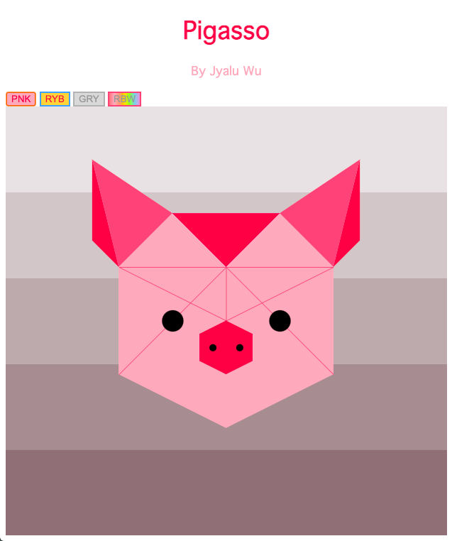
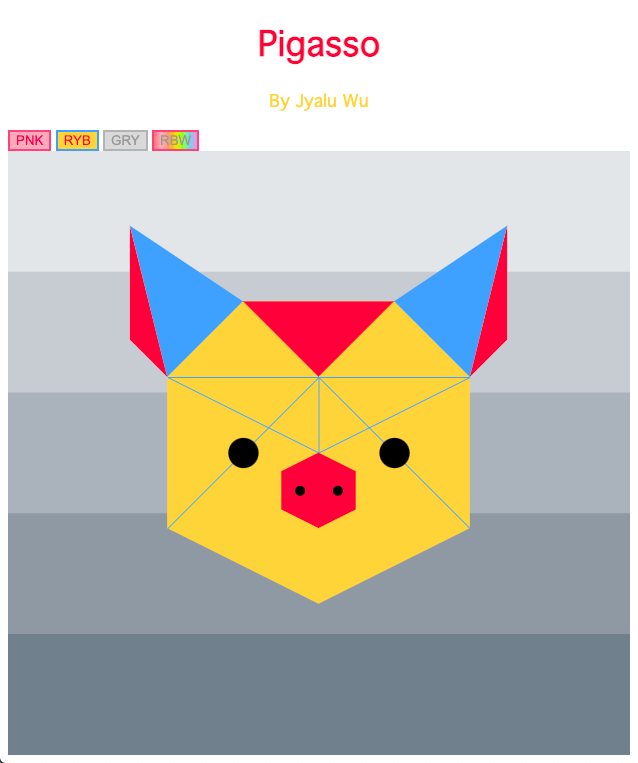

Assignment 1 - Hello World: GitHub and d3
===
By Jyalu Wu

GitHub Site
---
https://jwu2018.github.io/Pigasso/index.html


Description
---
For this project, I drew a pig that can change colors. Depending on which button you press, the pig will turn pink, red/yellow/blue, gray, or loop through the colors of the rainbow.






Technical Achievements
---
### Rainbow Loop
When you click the "RBW" button, the pig changes colors on its own! This was done using the `setInterval` and `clearInterval` functions.

### Dynamic Resizing
When you change the size of your window, the pig rescales so that it fits the screen. This was done by using a `viewBox` and telling the svg to redraw itself whenever the window was resized.


Design Achievements
---
### Colors
There are four coloring options to choose from:
- Pink
- Red/yellow/blue
- Gray
- Rainbow
The colors of the text and background also change when the pig changes color, which makes everything more cohesive and pleasant to look at.


Sources
---
1. [Stack Overflow - Proper format for drawing polygon data in D3] (https://stackoverflow.com/questions/13204562/proper-format-for-drawing-polygon-data-in-d3)
2. [Vegibit - Drawing Scalable Vector Graphics With D3 JavaScript] (https://vegibit.com/drawing-scalable-vector-graphics-with-d3-javascript/)
3. [Chartio - How to Resize an SVG When the Window is Resized in d3.js] (https://chartio.com/resources/tutorials/how-to-resize-an-svg-when-the-window-is-resized-in-d3-js/)
4. [CSS-Tricks - How to Scale SVG] (https://css-tricks.com/scale-svg/)


Requirements
---

1. Your project should contain at least four kinds of graphics primitives (circles, rectangles, lines, polygons) in different colors. 
2. Your document should identify the source of the code if you start with code that you found. 
3. Your code should be forked from the GitHub repo and linked using GitHub pages. See the "GitHub Details" section below for detailed instructions on how to do this.

GitHub Details
---

- Fork the GitHub Repository for Assignment 1. You now have a copy associated with your username.
- Make changes to index.html to fulfill the project requirements. 
- Make sure your "main" branch matches your "gh-pages" branch. See the GitHub Guides referenced above if you need help.
- Edit the README.md with a link to your gh-pages site "http://YourUsernameGoesHere.github.io/01-ghd3/index.html".

Submission Details
---
- To submit, make a [Pull Request](https://help.github.com/articles/using-pull-requests/) on the original repository.
- Note: name your pull request using the following scheme: 
```
a1-your Gh username-your first name-your lastname

```

Vis Details
---

For this project you should use d3.js. 
You can learn from examples on the [d3.js](http://d3js.org) site or start from scratch.

See the [Using d3js](https://github.com/mbostock/d3/wiki#using) documentation for how to run your own local server.

Creative solutions are welcome! In the past I've seen recreations of paintings, interactives, and more.

Go beyond the minimum requirements of this project.
Experiment with other aspects of the [d3 API](https://github.com/mbostock/d3/wiki/API-Reference) and [d3 Tutorials](https://github.com/mbostock/d3/wiki/Tutorials). 
Try making the elements interactive, for example, or animate them.

Grading
---

Grades are on a 120 point scale. 
96 points will be graded for functionality: the program does what the assignment requests with an informative README. 

We will use Google Chrome to view submissions. 
Be sure to test your code there.

Below are some, but not necessarily all, of the key points we will consider during grading:

- Circles and Rectangles  
- Lines  
- Polygons  
- Different colors  
- README Quality
    - A description of what you have created. 1-2 screenshots are recommended for the README.  
    - A working link to the hosted files (usually the gh-pages 'live' url)  
    - Section for Technical and Design Achievements

Technical Achievement Desription -- 12  
Design Achievement Description -- 12

Remember, it is up to *you* to define what constitutes a technical and design achievements.
Be ambitious as these are designed to allow you to shape your learning.
These are the only way to move from B to A territory.

