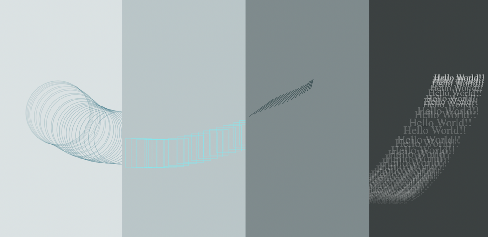

Assignment 1 - Hello World: GitHub and d3  
===

Introduction:
---

The goal of this project is to make particles in (circles, rectangles, lines and texts) shapes in different locations on the screen with different colors using d3.js

Project Description:
---

I started with this example [1] from bl.ocks.org. The code [1] is written in 3d.js v3 so I had to look for updates in this website [2] for v6. 
I devided the page into four columns. I added svg for each column and apended rectangle to it with ontouchstart event. 
When touching the first column of the page, the pointer position got returned, then particles of circles got created based on the position of the pointer and when touching the second column of the page, particles of rectangles got created, and so on. (Each column has a different element 'circle, rectangle, line, or text'). I used d3.lch() function to give each element a different color. A screenshot of the page is added below:

(Note: I did merge two screenshots together in order to display all of the mouse movements in one image).

Technical and Design Achievements:
---

1. Creating different elements in d3 (Circle, rectangle, line, text).
2. Making the graph interactive by generating graphs ontouchstart.

Sources:
---

1) https://bl.ocks.org/mbostock/1062544
2) https://observablehq.com/@d3/d3v6-migration-guide
3) https://webdva.github.io/how-to-draw-a-line-in-d3js/
