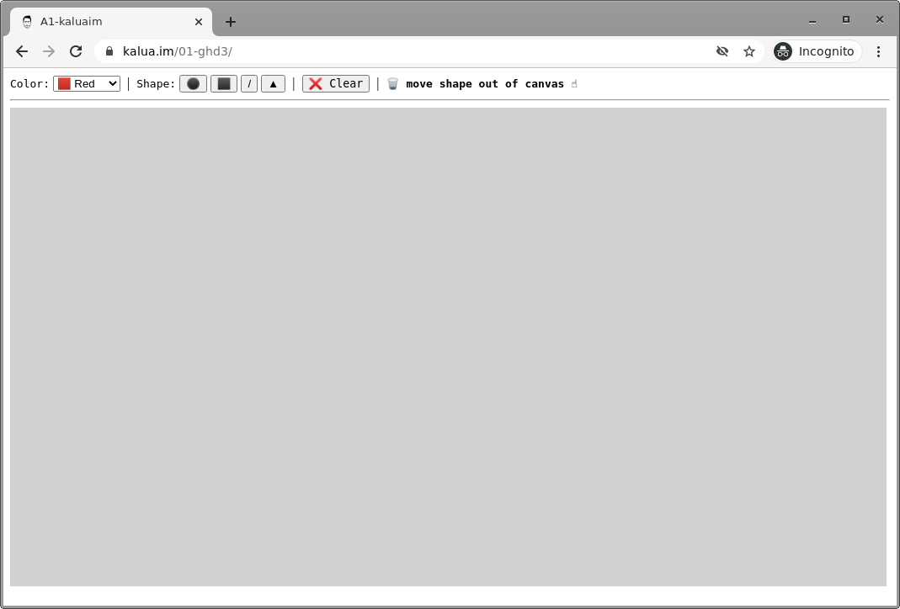

# Assignment 1 - Hello World: GitHub and d3  

[Live link](https://kalua.im/01-ghd3/)

---
## Description
This project was built from scratch to allow me to have a better understanding of D3. I built a simple tool for drawing with shapes that are created with D3. This tool allow users to pick colors and shapes then place them on the canvas with the option to move the shapes anywhere. 

## Screenshots

## Achievement

### Technical
- Applied different types of transitions: When shapes are placed on canvas they appear with different transitions. For example, when a circle is added it gets build from the center of the circle, with the radius changing is size, and so on.
- Users can drag shapes in the canvase: When dealing with draging shapes in D3, I had to work with each shape differently as they have different ways in calculating the next position on the canvas. Drag is inspired form https://observablehq.com/@d3/circle-dragging-i
- Canvas is resposive: Each time the size of the browser change, the canvas change accordingly.
- I used predefined constants for the configuration: Instead of using magin numbers I chose to define constants that could be exposed to users for further customization.

### Design
- Colors and opacity: while the tool only offers the three essenstial color RGB, I have played around with the opacity to allow users to mix and create more interesting colors. When shapes overlap, users can see the shapes behind. This allows users to get creative with the vis encoding and colors. (e.g. If you place a red shape over a blue shape you would get purple)
- simple yet interactive user experience. I placed the interactive elements from left to right following the natural reading process. First, users choose a color, then shape and after that they get to place the shape where they want to on the canvas.
- Added a transition (animation) when shapes are placed on canvas to add more smoothness to the experience.
