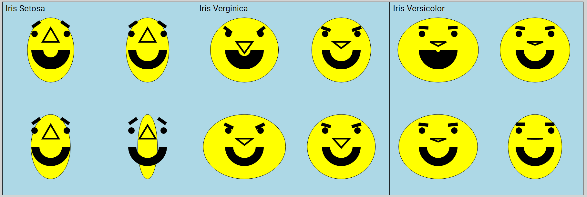

Assignment 1 - Hello World: GitHub and d3  
===
By Andrew Nolan

Github Pages Link
---
https://acnolan.tech/01-ghd3/

Submission Description
---
### A Brief Journey into Chernoff Faces
Last summer I took CS 548, Knowledge Discovery and Data Mining. In that course we briefly discussed data visualizations and the one that always stuck in my head was Chernoff Faces [3]. Since I am starting to learn d3 and data visualizations. I thought an appropriate starting point would be trying to create this visualization type that haunts my mind.

The first thing I created was a simple face. I had never used SVG's or d3 before so I followed, and then expanded on, a tutorial video [1]. This face is an ellipse, the eyebrows are rectangles, the nose is a polygon, the eyes are circles, and the mouth is a path that follows an arc. 

Next, I added sliders based on an answer to a stack overflow post about d3 sliders [2]. These sliders use svg lines, d3.drag, and css styling to make an interactive slider. The original post was to make a color slider, but I adjusted the code to perform transformations or modify the attributes of svg primitives. Now the sliders allow you to change the face width, the smile inner radius, the nose height, and the angle of the eyebrows. A screenshot of this face and slider can be seen below:

The sliders and face probably would have been more than enough for this project, but I wanted to create Chernoff Faces, not just an interactive face. Chernoff Faces are a data visualization, so I needed data. I downloaded the famous Iris Dataset often used in introductory machine learning competitions [4]. This dataset contains 150 rows with 4 attributes identifying 3 different classes. A copy of the CSV for this data can be found in my github repo. I coded a subset of 12 rows of this data into JavaScript code and used this data to generate 12 Chernoff Faces, 4 for each class. The data visualization was successful, and users can look at the faces (as shown below) and clearly see that the 3 different classes are clustered appropriately based on the Chernoff Faces and each class is distinctly different from the others.

Finally, I added text to the Github Page that summarized my story and walks through my process of learning about Chernoff Faces. I analyzed the faces and determined that the eyebrows and nose height (petal width and petal height respectively) are the best features for identifying the iris class with this visualization. 

Technical and Design Achievements
---
### Technical Achievements
1. Created a Chernoff Face using d3 svg primitives including rectangles, arcs, ellipses, circles, lines, and polygons. Additionally, created four interactive sliders using d3. These sliders can be dragged to cause a real time transformations of the svg attributes of the face. These transformations include, adjusting the inner radius of an arc, adjusting a point in a polygon, doing a rotation transformation on a rectangle, and changing the x radius of an ellipse.

2. Loaded data and used d3 to visualize the data using Chernoff Faces. After February 4th's lecture I learned I did not load and use the data in the correct d3 way, so in the future I now know what to do. But nevertheless, data is loaded and manipulated with JavaScript. Then it is used to transform and adjust attributes of an SVG to create Chernoff Faces to visualize data from the famous Iris Data set [4]. Results of the visualization are analyzed and discussed on the webpage.

### Design Achievements
1. Built Chernoff Faces using d3 and svg primitives such as rectangles, arcs, ellipses, circles, lines, and polygons. The faces look pretty good. 

2. The github page is responsive and will use conditional css when the width of the browser window shrinks. A limitation with this is the browser can not be made smaller than the svg, or else there will be horizontal scrolling. However, on mobile devices the content fits correctly. 

3. Tested on firefox and chrome for a Windows PC on two different sized monitors. Also tested on Safari for an iPhone SE (2nd gen). The page loads and looks good on all of these platforms, although unfortunately, the slider does not work on mobile devices.

4. Finally, the webpage recieves very high scores according to Chrome's Dev Tool's Lightouse tool. This tool provides feedback to help developers ensure their websites are accessible and follow best practices. Most impressively, this page recieves a perfect accessibility rating of 100.

Sources
---
All of these were used by me in order to complete this assignment. Any code provided by these sources was significantly changed/expanded on by me for this project.
1. Intro to D3.js - Let's Make a Face: https://www.youtube.com/watch?v=-RQWC4I2I1s
2. Using D3 slider to change attribute: https://stackoverflow.com/questions/42878866/using-d3-slider-to-change-attribute
3. Chernoff Face Wikipedia: https://en.wikipedia.org/wiki/Chernoff_face
4. Iris Data Set: https://archive.ics.uci.edu/ml/datasets/iris