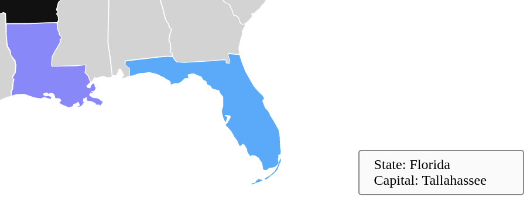

Assignment 1 - Hello World: GitHub and d3  
---
For this assignment I considered exploring the following svg componenets:
- lines 
- text
- circle
- color components with different colors
- rectangle

Below are a few examples of the d3 exploration.
 
 
 
Technical and Design Achievement
---
For this project, I wanted to explore the technical challenges and the learning curve I'd face if I tried to integrate d3 to manipulate preexisting SVG on a website. The technical difficulties of implementing and exploring the basic features of D3.js were relatively straight forward, and the plugin implementation was easy. The documentation was very straightforward, and the concepts were easy to pick up. I also explored how well d3.js can replicate the practice of embedding data using data-* attribute. D3 handled both the traditional usage approach and the comparatively newer DOM approach, where you store the data by binding it to the object's instance. We can see the data bound to each svg element by hovering over the elements on and around the map. For the states the tool tip on the bottom right hand side shows the name of the state and the capital of the state. To have the hover more interactive the states get hilighted with blue color when you hover you mouse on it.

